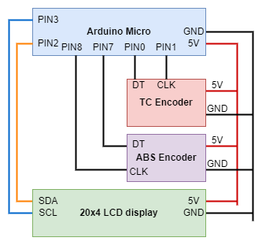

# ACTC

USB controller for Assetto Corsa with following features:

* Adjusting TC and ABS levels with rotary encoders.
* Displaying current TC and ABS settings.
* Displaying current session lap information:
    * lap count,
    * best lap time,
    * last lap time.

## Circuit diagram



## Installation

Assetto Corsa plugin is required for communication with the controller. This plugin can be installed with ``install.ps1`` script within ``plugin`` folder (you may have to adjust target folder within the script). After installation, you need to configure controller COM port in ``config.ini`` within the plugin folder:

```
[serial]
port=COM28
baudrate=9600
```

Usually the port should stay the same when reconnecting the controller, so you need to set it just once. You may have to activate the plugin in AC Content manager as well. In game the plugin is just an empty window, but in indicates that the plugin was loaded correctly.

## Configuration

Controller requires binding increasing/decreasing TC and ABS levels to correct keys within Assetto Corsa. Default settings
is following:

* ``p`` -- TC increase,
* ``o`` -- TC decrease,
* ``k`` -- ABS increase,
* ``j`` -- ABS decrease.

Keys can be changed in ``Config.hpp``, but this requires reflashing the Arduino firmware.